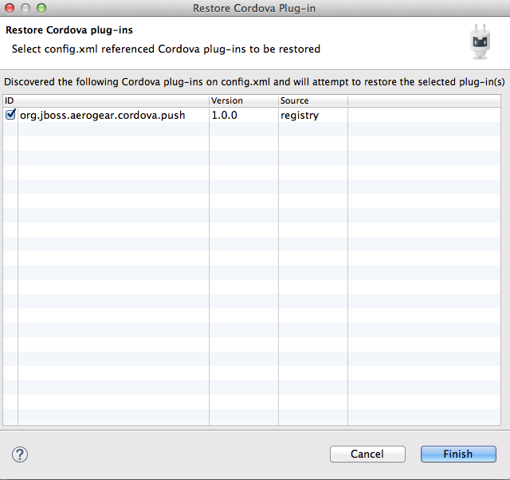

cordova: CRUD contact Mobile Application showing the AeroGear Push feature 
==========================================================================
Author: Erik Jan de Wit (edewit)   
Level: Beginner   
Technologies: JavaScript Cordova   
Summary: A crud mobile app with push integrated   
Target Product: Mobile  
Product Version: MP 1.0   
Source: https://github.com/aerogear/aerogear-push-quickstarts/tree/master/client/contacts-mobile-cordova

What is it?
-----------

This project is a very crud application where you can manage contacts integrated push notifications. When a new Contact is created a notification is send to all the users.

System requirements
-------------------

What is needed for Cordova:

The Cordova command line tooling is based on node.js so first you'll need to [install node](http://nodejs.org/download/)

then you can install Cordova by executing:
```
npm install -g cordova
```

To deploy on ios you need to install the ios-deploy package as well
```
npm install -g ios-deploy
```

### Cordova-Android

To deploy and run Cordova applications on Android the Apache Ant tool needs to be [installed](http://ant.apache.org/manual/install.html).


Build and deploy the backend
----------------------------

If you have not yet done so, you must build and deploy the server part for this client to 'talk' to.

Build and Deploy the Example
----------------------------

## iOS
For iOS you'll need a valid provisioning profile as you will need to test on an actual device (push notification is not available when using a simulator)
Replace the bundleId with your bundleId (the one associated of your certificate), by editing the config.xml in the root of this project change the id attribute of the `widget` node. After that run a `cordova platform add ios` to change the Xcode project template.

If you want to change your bundleId later on, you will still have to run a `cordova platform rm ios` followed by `cordova platform add ios` to change the Xcode project template.

## Change Push Configuration

There are 2 examples for cordova one is build using [jquery mobile](jqm) and one with [angular](angular). The README.md located in these directories will direct you to the settings you'll need to change to setup push notifications.

After changing the push configuration you can install the platforms you want to install the cordova app on currently only android and ios are supported.

Install platforms
```
cordova platform add ios android
```

Restore the plugins
```
cordova --experimental restore plugins
```

Run the application on a device
```
cordova run <android or ios>
```

Application Flow
----------------------

## Sign in
You can sign in with one of the [default users](https://github.com/aerogear/aerogear-push-quickstarts/tree/master/client#default-users)


FAQ
--------------------


Run the Quickstart in JBoss Developer Studio or Eclipse
-------------------------------------------------------

- Import the generated project into JBDS


- Select the project location and project


- When prompted accept the plugin installation  



- Run the project on a device


Debug the Application
=====================

Start a browser chrome for android or safari for iOS

iOS 
* Develop -> < device name > -> index.html

Android
* Menu -> Tools -> Inspect Devices -> inspect
